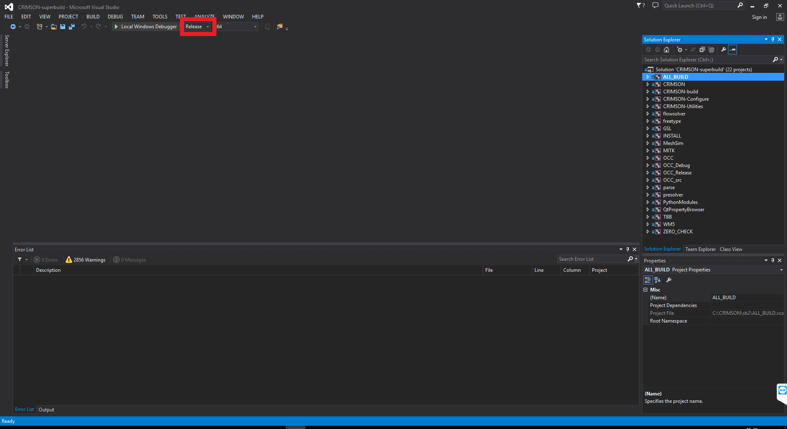
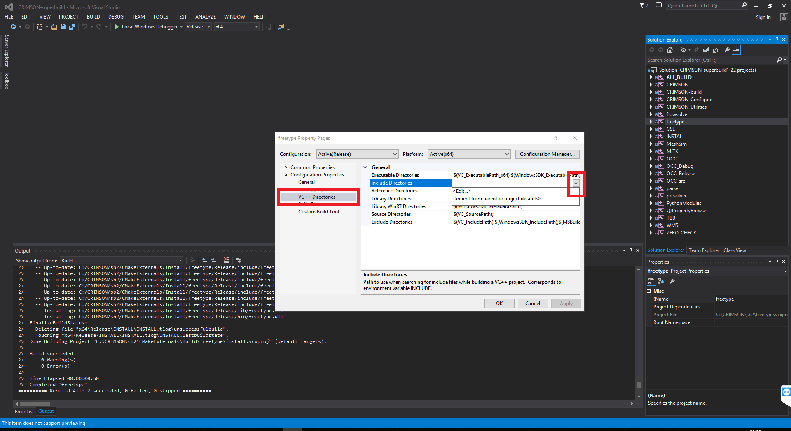
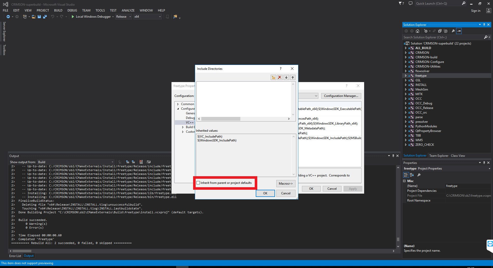
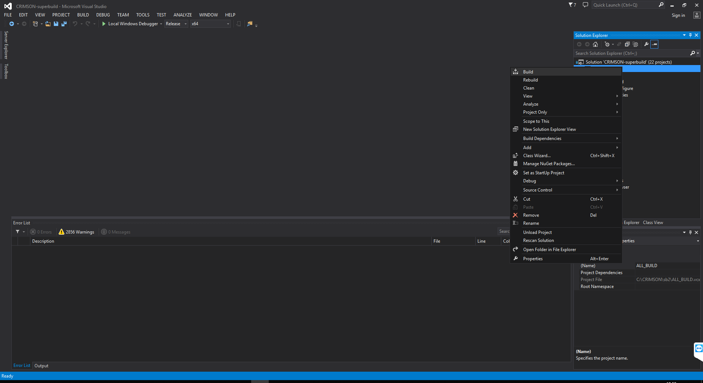
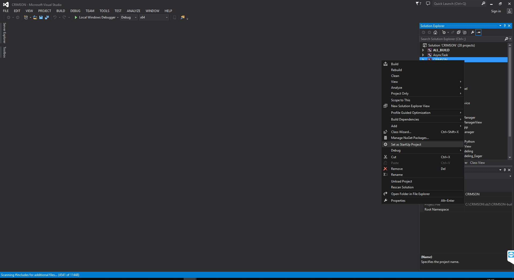

# CRIMSON Build instructions for Windows
### by Marija Marcan, Chris Arthurs and Alex Melville

## Cautionary Note
Please be aware that CRIMSON is a very large project, and compilation will take a very long time. Additionally, be aware that it must be built precisely following these instructions. If an incorrect step is taken, the best course of action is most likely to delete the CRIMSON folder and start again. Your system will require up to 55 GB of available hard drive space.

## Dependencies to install before building CRIMSON
Before building CRIMSON software itself you will need to download and install the following:

 - Git - 2.19.2 or later (https://git-scm.com/downloads)
 - CMake - 3.13.0 (https://cmake.org/download/)
 - Qt - 5.7 (exactly) - archived here: https://umich.app.box.com/s/kcvgbavtyy1y6yubgang5l7re4xso2fa - download the msvc2013 64 bit windows installer executable: qt-opensource-windows-x86-msvc2013_64-5.7.0.exe. During installation, amongst the components under 5.7, you only need "msvc2013 64-bit", "Qt WebEngine" and "Qt Script"
 - Visual Studio - VS2013 (tested with Update 5)
 - Download the [Presolver executable](https://umich.box.com/s/pa5s9ua248g79mbd2er47j4keyd6v6j4), put the zip file somewhere on your hard drive, you don't need to extract it.

For installing the above software follow the instructions as provided by their publisher.

Please note that the CRIMSON build procedure has been tested and is supported for the versions of software mentioned above. While it might be possible to succesfully build CRIMSON using other versions of Git, CMake or Visual Studio it is not necessary that the CRIMSON build steps as described below would be sufficient, so proceed at your own responsibility.

## Building CRIMSON
#### Keep the build directory as short as possible

- I usually keep the source code in a directory like `C:\crimson`
- I build to a directory like `C:\cr`, because it is very easy to hit the max path limit in Windows

### Notes about cmake-gui
- CMake expects forward slashes (‘/’) for all directory and file paths, not back slashes (‘\’), which are what is usually used on Windows.
    - **That means that you should not just copy/paste paths from Windows Explorer into CMake.**
    - If you use CMake’s built in file browser, it will auto-correct the slashes
    - One trick is to paste a path into the file browser, hit enter, and select that and CMake will correct the paths for you.
    - The file browser will not let you specify directories that don’t exist, though (like the presolver), in that case you will just have to type it out and rely on CMake’s autocomplete.
- In cmake-gui, if you click anywhere on the right side of the table in the configuration options on a boolean option (not just on the checkbox), CMake will toggle that option
    - **So be very careful about accidentally clicking in this area**, it may take 5 hours for you to find out that you accidentally clicked something, most of the check boxes will completely break the build if you accidentally enable or disable something

### Conventions used in this guide:
- In the instructions that follow this page, I will refer to a build that takes place in `C:\cr\`, if you see `C:\cr` and you built to a different directory, adjust that path to the path that you used.

1. Acquire the source
```
git clone https://github.com/carthurs/CRIMSONGUI.git
```

2. I renamed the directory to crimson, for me I put it in `C:\crimson`
3. Start cmake-gui (you should be able to start that from “run”, win+R)
4. For the source directory choose `C:/crimson`
5. For the build directory, make a directory named `c:/cr`

Configure 1:

6. Click configure
7. For the generator, choose `Visual Studio 12 2013 Win64`, leave everything else at defaults then click finish
8. It will error out
9. Check `CMAKE_BUILD_TYPE`, it must be `Release` if you are intending to package an installer. Use `Debug` builds for development.
10. Make sure that `CRIMSON_MESHING_KERNEL` is `CGALVMTK`
11. Check `CRIMSON_BUILD_TRIAL_VERSION` if you are making a trial release (we distribute trial releases through the mailing list). The expiration date is set automatically in the code using expiration dates, you do not need to edit this manually.
12. Set `Qt5_DIR` to `C:/Qt/Qt5.7.0/5.7/msvc2013_64/lib/cmake/Qt5`

Configure 2:

13. Click configure again
14. For `presolver_executable`, manually type in something like  `C:/cr/CMakeExternals/Source/presolver/presolver.exe` (note forward slashes)
15. For `presolver_url`, browse for the presolver zip file you downloaded earlier, the path should be something like `C:/_FILES/Installs/presolver_win.zip`
16. Hit configure again, it will succeed
17. Click Generate

	
### Build your project in Visual Studio

#### Notes:

The solution generated for Visual Studio at this time is primarily just to compile the project and run the generated cmake scripts, to browse the source use a text editor of your choice, e.g., [Visual Studio Code](https://code.visualstudio.com/).

The build process will primarily use the Output and Error List windows, we recommend having both of these windows pinned/docked. If the Output and Error windows are visible, it's possible to double click on an error in the Error window and immediately go to the console output that caused the error in the Output window.

#### Build Process:
 - Open the build folder of the project which you have previously created (in our example this is "C:\CRIMSON\sb").
	The folder contains project files which were generated by CMake for our selected version of Visual Studio (2013). These Visual Studio files belong to the CRIMSON superbuild (build configuration which automatically builds CRIMSON with all of its external dependencies, one of which is MITK. Note here that the MITK itself also has its own external dependencies). 
	Inside the overall superbuild CRIMSON project, MITK and its dependencies are being built in a superbuild project of their own (inside the folder `MITK-superbuild`). Project files for building of other external dependencies of CRIMSON are located in folder `CMakeExternals`. The project files for building of CRIMSON core are in folder `CRIMSON-build`.
 - In the CRIMSON superbuild folder (`C:\CRIMSON\sb`) open the file named `CRIMSON-superbuild` of the type "Microsoft Visual Studio Solution". This opens the CRIMSON superbuild project in Visual Studio.
 - Make sure that the build type selected in Visual Studio matches the build type you determined in CMake (sometimes these types do not automatically match).
	
	

 - In order to avoid known collision between an `fttypes.h` header that exists under project "freetype" and in standard Windows Kit 8.1 (same name, different contents), do the following:
	 - In the Solution Explorer pane on the right, right-click the node "freetype" and select "Properties" (last entry). 
	 - On the left side of the new window that pops up select "VC++ Directories"
	 - Click on "Include Directories" on the right side, and then on the down arrow on the very end of that line to edit the field.
	 - In the drop-down menu select "Edit..."
	
		
	
	 - On the bottom of the new window, make sure the field "Inherit from parent or project defaults" is UNTICKED
	
			

 	- Sometimes this does not work, so you are very strongly advised to also locate the `fttypes.h` file (`C:\Program Files (x86)\Windows Kits\8.1\Include\shared\fttypes.h`) and rename it temporarily to something else. After the build process completes, you should rename it back to `fttypes.h` so that it doesn't interfere with other compilation work on your system.
 
 - In the Solution Explorer pane on the right, right-click the "ALL\_BUILD" node and press "Build"

	
 - Wait for all the project files to build. You can observe the progress in the "Output" window.
 

## Running the built project inside Visual Studio
 - In order to run CRIMSON from Visual Studio (e.g. for debugging purposes) navigate to the CRIMSON build folder (`C:\CRIMSON\sb\CRIMSON-build`) and open the file named `CRIMSON` of the type "Microsoft Visual Studio Solution". This opens the CRIMSON core build project in Visual Studio.

 - Right-click on the node "CRIMSON" in Solution Explorer and select "Set as StartUp project"
	
	
	
 - You are now ready to run/debug CRIMSON from within Visual Studio
  - Ensure that the build type matches the build you created (recommended: `Release`) in the build type in the Visual Studio toolbar
  - Click the "Local Windows Debugger" button with the green triangle to launch CRIMSON
  - You may get pop-ups informing you that the project is out of date, and asking if you want to rebuild. Click "No"
  - If you get a pop-up informing you that the debugging information is missing and asking if you want to continue, click "Yes"

## Adding flowsolver to your CRIMSON build
 - Run the flowsolver installer. 
 - Make sure to specify the same folder for unpacking as the one specified under `flowsolver_folder` variable during CMake configuration.
 
## Running CRIMSON outside of Visual Studio

- The executable file for CRIMSON will be written to, e.g., `"C:\crimson\sb\CRIMSON-build\bin\Release\CRIMSON.exe"`. 
- To run CRIMSON, use the batch file in e.g., `"C:\crimson\sb\CRIMSON-build\bin\startCRIMSON_release.bat"`
