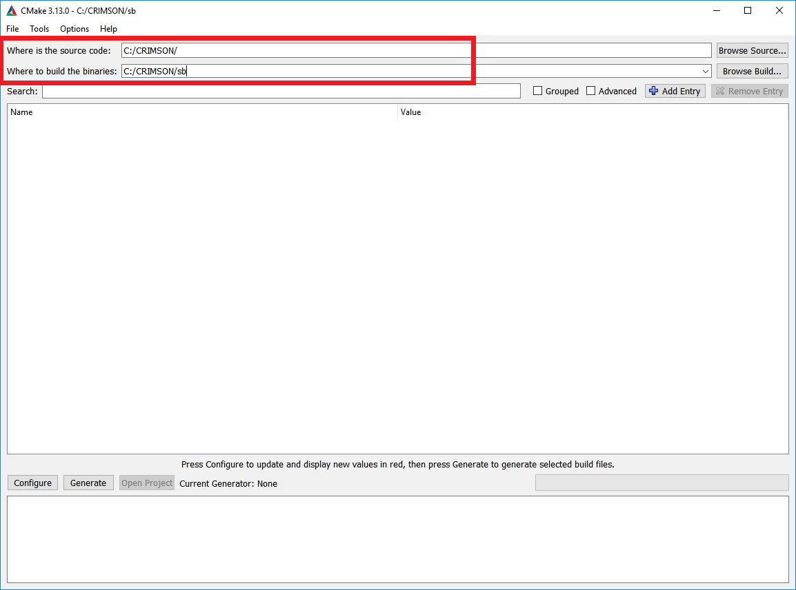
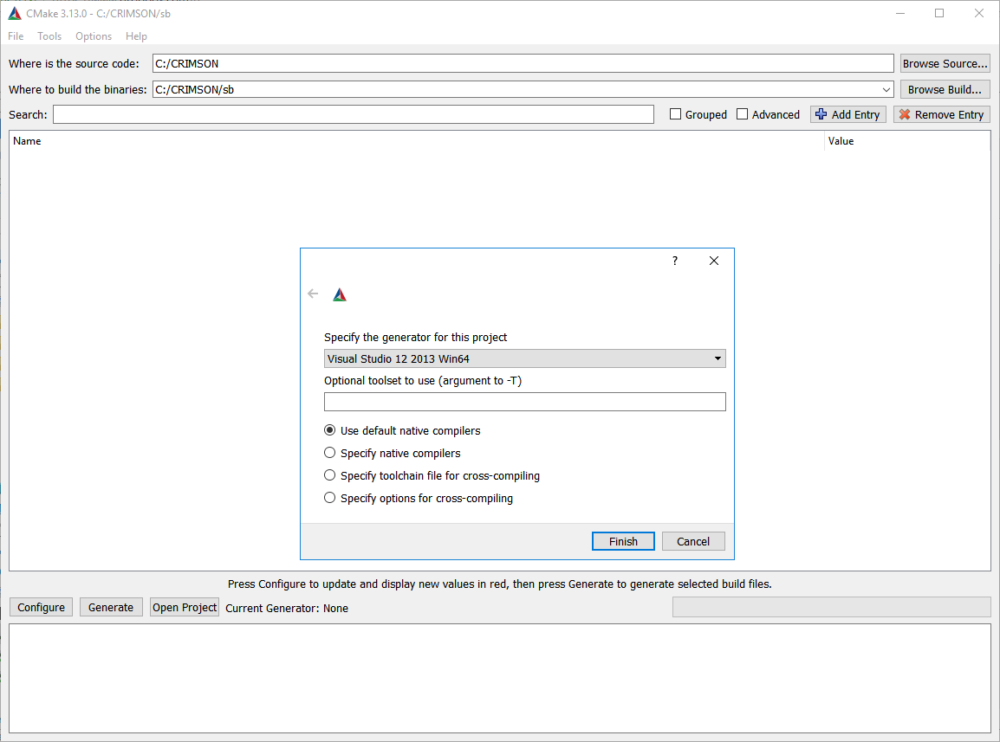
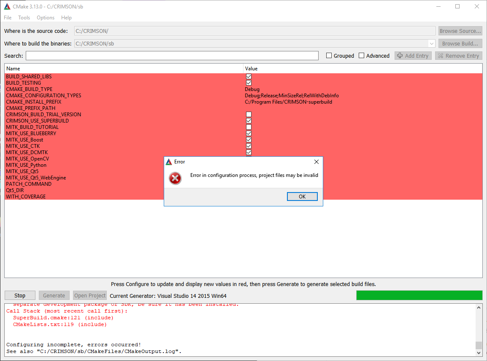

# CRIMSON Build instructions for Windows
### by Marija Marcan, Chris Arthurs and Alex Melville

## Cautionary Note
Please be aware that CRIMSON is a very large project, and compilation will take a very long time. Additionally, be aware that it must be built precisely following these instructions. If an incorrect step is taken, the best course of action is most likely to delete the CRIMSON folder and start again. Your system will require up to 55 GB of available hard drive space.

## Dependencies to install before building CRIMSON
Before building CRIMSON software itself you will need to download and install the following:

 - Git - 2.19.2 or later (https://git-scm.com/downloads)
 - CMake - 3.13.0 (https://cmake.org/download/)
 - Qt - 5.7 (exactly) - archived here: https://umich.app.box.com/s/kcvgbavtyy1y6yubgang5l7re4xso2fa/file/653204395845 (or, in case of problems with that link, https://umich.app.box.com/s/kcvgbavtyy1y6yubgang5l7re4xso2fa and download the msvc2013 64 bit windows installer executable: qt-opensource-windows-x86-msvc2013_64-5.7.0.exe). During installation, amongst the components under 5.7, you only need "msvc2013 64-bit", "Qt WebEngine" and "Qt Script"
 - Visual Studio - VS2013 (tested with Update 5)

For installing the above software follow the instructions as provided by their publisher.

Please note that the CRIMSON build procedure has been tested and is supported for the versions of software mentioned above. While it might be possible to succesfully build CRIMSON using other versions of Git, CMake or Visual Studio it is not necessary that the CRIMSON build steps as described below would be sufficient, so proceed at your own responsibility.

## Building CRIMSON
### Setup the project directory
Create a root folder in which the source code and build will be stored.
The root folder for the project should be as short as possible (due to some limitations of the Windows command line). 
For example, a source folder like "C:\CRIMSON" and a build folder like "C:\CRIMSON\sb" should be good enough.

### Get the source code via Git
Get the source code via git by cloning into the root folder selected above by following these steps:

 - Open the Windows Command Prompt (Windows key - type "cmd" - press Enter).
 - Change the current working directory to the location of project root directory. e.g. for root directory "C:\CRIMSON" type 
	``cd c:\CRIMSON``
	into the command prompt and press Enter.
 - Type 
	``git clone https://github.com/carthurs/CRIMSONGUI.git .``
	(Notice the dot at the end of the above command, it is there intentionally!) and press "Enter". You will need to adjust the repository URL if you are getting it from somewhere else.

### Generate project files with CMake
 - In the root folder of the CRIMSON project create a new folder for the build, e.g. `C:\CRIMSON\sb`
 - Open the CMake desktop app, `cmake-gui`.
 - Under "Where is the source code" enter the path to the CRIMSON root folder (e.g. `C:\CRIMSON`)
 - Under "Where to build the binaries" enter the path to the CRIMSON build folder you created just recently (e.g. `C:\CRIMSON\sb`)

 

 - Press "Configure"
 - In the new window that pops up, under "Specify the generator for this project" select "Visual Studio 12 2013 Win64". Leave the remaining settings as they are and press "Finish".
	
	
	
 - An error message pops up. Press okay to continue.
	
	
	
 - The large window in the centre now contains pairs of variable names and values colored red, some of which need to be manually set for a succesfull build. Find a variable `Qt5\_DIR` and set it to `C:\Qt\Qt5.7.0\5.7\msvc2013_64\lib\cmake\Qt5` (assuming that you installed Qt in the default directory `C:\Qt`, otherwise replace the `Qt` part by the path which you chose during Qt installation - you may have to adjust this path slightly, sometimes it has `Qt5.7.0` as one of the folders; sometimes it does not).
 - Change `CMAKE\_BUILD\_TYPE` as desired (`Release`, `Debug` or `RelWithDebInfo`). `Release` is recommended. Leave other variables as they are. Caution - ensure that before you build in Visual Studio, you set the same mode in the toolbar at the top. Again, `Release` is very strongly recommended.
 - Press "Configure".
 - Additional variables that can be modified appear now. You need to manually specify the locations of flowsolver and presolver:

	 - For `flowsolver\_folder` enter e.g. `C:\CRIMSON\sb\CMakeExternals\Source\flowsolver`
		\linebreak Note: This is simply a stub folder for where CRIMSON expects flowsolver files to be located. Actual flowsolver files are copied there after running the separate flowsolver installer.
	 - For `presolver\_executable` enter e.g. `C:\CRIMSON\sb\CMakeExternals\Source\presolver\presolver.exe`.
		In variables above replace `C:\CRIMSON\sb` with your own custom location of CRIMSON superbuild folder as necessary.

 - Press "Configure"
 - Press "Generate"
	
### Build your project in Visual Studio

 - Open the build folder of the project which you have previously created (in our example this is "C:\CRIMSON\sb").
	The folder contains project files which were generated by CMake for our selected version of Visual Studio (2013). These Visual Studio files belong to the CRIMSON superbuild (build configuration which automatically builds CRIMSON with all of its external dependencies, one of which is MITK. Note here that the MITK itself also has its own external dependencies). 
	Inside the overall superbuild CRIMSON project, MITK and its dependencies are being built in a superbuild project of their own (inside the folder `MITK-superbuild`). Project files for building of other external dependencies of CRIMSON are located in folder `CMakeExternals`. The project files for building of CRIMSON core are in folder `CRIMSON-build`.
 - In the CRIMSON superbuild folder (`C:\CRIMSON\sb`) open the file named `CRIMSON-superbuild` of the type "Microsoft Visual Studio Solution". This opens the CRIMSON superbuild project in Visual Studio.
 - Make sure that the build type selected in Visual Studio matches the build type you determined in CMake (sometimes these types do not automatically match).
	
	

 - In order to avoid known collision between an `fttypes.h` header that exists under project "freetype" and in standard Windows Kit 8.1 (same name, different contents), do the following:
	 - In the Solution Explorer pane on the right, right-click the node "freetype" and select "Properties" (last entry). 
	 - On the left side of the new window that pops up select "VC++ Directories"
	 - Click on "Include Directories" on the right side, and then on the down arrow on the very end of that line to edit the field.
	 - In the drop-down menu select "Edit..."
	
		
	
	 - On the bottom of the new window, make sure the field "Inherit from parent or project defaults" is UNTICKED
	
			

 	- Sometimes this does not work, so you are very strongly advised to also locate the `fttypes.h` file (`C:\Program Files (x86)\Windows Kits\8.1\Include\shared\fttypes.h`) and rename it temporarily to something else. After the build process completes, you should rename it back to `fttypes.h` so that it doesn't interfere with other compilation work on your system.
 
 - In the Solution Explorer pane on the right, right-click the "ALL\_BUILD" node and press "Build"

	
 - Wait for all the project files to build. You can observe the progress in the "Output" window.
 

## Running the built project inside Visual Studio
 - In order to run CRIMSON from Visual Studio (e.g. for debugging purposes) navigate to the CRIMSON build folder (`C:\CRIMSON\sb\CRIMSON-build`) and open the file named `CRIMSON` of the type "Microsoft Visual Studio Solution". This opens the CRIMSON core build project in Visual Studio.

 - Right-click on the node "CRIMSON" in Solution Explorer and select "Set as StartUp project"
	
	
	
 - You are now ready to run/debug CRIMSON from within Visual Studio
  - Ensure that the build type matches the build you created (recommended: `Release`) in the build type in the Visual Studio toolbar
  - Click the "Local Windows Debugger" button with the green triangle to launch CRIMSON
  - You may get pop-ups informing you that the project is out of date, and asking if you want to rebuild. Click "No"
  - If you get a pop-up informing you that the debugging information is missing and asking if you want to continue, click "Yes"

## Adding flowsolver to your CRIMSON build
 - Run the flowsolver installer. 
 - Make sure to specify the same folder for unpacking as the one specified under `flowsolver\_folder` variable during CMake configuration.
